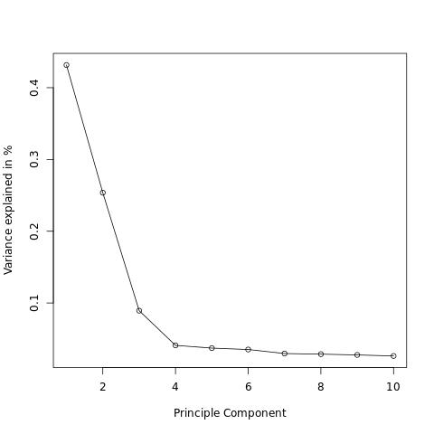
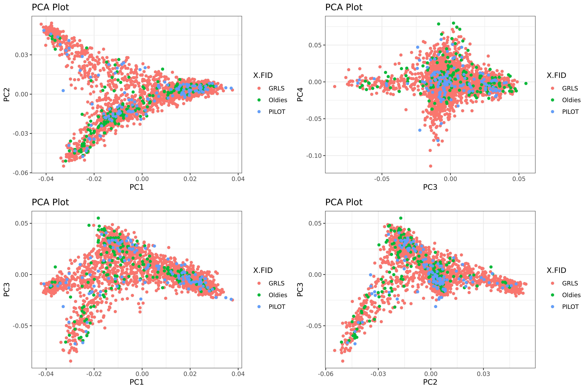

The phenotype of interest will define the GWAS design. Some phenotypes are quantitative like body mass index or fasting blood glucose while other are qualitative, binary phenotypes (e.g., Case/Control studies). Each type requires special preparation of the input data, proper selection of the statistical tests, and mindful interpretation of the final results. This tutorial, is an example for a Case/Control study.  

To start, the cases and controls must be selected based on the inclusion and exclusion criteria for the project. Accordingly, a subest of the genotypic and phenotypic data should be established. Then, the possible correlation of the phenotype of interest should assessed with the genetic principal components in the studied population.  The possible covariates that might affect our phenotype of interest must also be idenfitied, but that will be done during the assessment of heritability of the phenotype in the studied population. 

## 5.1. Explore phenotypes

## 5.1.1. Identify affected cases until last year

Most of the input files are designed to have 2 rows for each new year of study. The 1st row records the new phenotypes diagnosed only in that study year while the 2nd row records all phenotypes diagnosed from baseline through that study year. The column `to_date` is encoded 0 for the former and 1 for the latter. More can be read about the design of each table in the [Data Commons](https://datacommons.morrisanimalfoundation.org/) of Morris Animal Foundation.

```
# Define and create the GWAS output folder
gwas="gwas_output" && mkdir -p "$gwas"

# Identify the 2nd row of the last year of study for each dog
tissue="skin"
cat phenotypes/conditions_${tissue}.csv | awk 'BEGIN{FS=","}\
    NR==1{print $0;next}{if ($5==1) {\
    if (!($1 in max_year) || $3 > max_year[$1]) {
        max_year[$1] = $3;
        line[$1] = $0;
    }}}END{for (id in line) {print line[id];}}' | tr ',' '\t' > "$gwas"/conditions_${tissue}_lastYear.tab
```

## 5.1.2. Count the of cases of each phenotype
```
# Get the number of columns in the header
num_columns=$(head -n 1 "$gwas/conditions_${tissue}_lastYear.tab" | awk -F"\t" '{print NF}')

# Loop over each column from the third till the last, and print the sum
for ((i=7; i<=$num_columns; i++)); do
    awk -v col="$i" 'BEGIN{FS=OFS="\t"}NR==1{dis=$col;next}{sum+=$col} END {print dis,sum}' "$gwas"/conditions_${tissue}_lastYear.tab
done > "$gwas"/conditions_${tissue}.no_of_cases
```

## 5.2. Sample selection

## 5.2.1 Select "cases" of a target phenotype
```
target="atopy"
Tcol=$(head -n 1 "$gwas/conditions_${tissue}_lastYear.tab" | awk -F"\t" -v pheno="$target" '{for (i=7; i<=NF; i++){if($i==pheno)print i}}')
awk -v Tcol="$Tcol" 'BEGIN{FS=OFS="\t"}NR==1{print;next}{if($Tcol=="1")print}' "$gwas"/conditions_${tissue}_lastYear.tab > "$gwas"/conditions_${target}_lastYear.tab

tail -n+2 "$gwas"/conditions_${target}_lastYear.tab | cut -f1 > "$gwas"/${target}_cases.ids
```

## 5.2.2 Check for co-existing conditions
```
for ((i=7; i<=$num_columns; i++)); do
    awk -v col="$i" 'BEGIN{FS=OFS="\t"}NR==1{dis=$col;next}{sum+=$col} END {if(sum)print dis,sum}' "$gwas"/conditions_${target}_lastYear.tab
done > "$gwas"/conditions_${target}_lastYear_coexist.tab
```
For now, no sample will be excluded from cases


## 5.2.3. Identify individuals to be excluded from controls
```
grep 'allergic_reaction\|seasonal_allergy\|angioedema\|facial_edema\|.*_dermatitis\|r_o_atopy\|vaccine_reaction' "$gwas"/conditions_${tissue}.no_of_cases > "$gwas"/${target}.to_be_excluded.lst
while read offTarget;do
  offTcol=$(head -n 1 "$gwas"/conditions_${tissue}_lastYear.tab | awk -F"\t" -v pheno="$offTarget" '{for (i=7; i<=NF; i++){if($i==pheno)print i}}')
  awk -F"\t" -v Tcol="$Tcol" -v offTcol="$offTcol" 'NR>1{if($Tcol!="1" && $offTcol=="1")print $1}' "$gwas"/conditions_${tissue}_lastYear.tab
done < <(cut -f1 "$gwas"/${target}.to_be_excluded.lst) | sort | uniq > "$gwas"/${target}.to_be_excluded.ids
```

## 5.2.4. Remove the excluded samples from the genotyping dataset (include the oldies if not testing a phenotype with high mortality in young age)
```
cat "$gwas"/${target}.to_be_excluded.ids | grep -Fwf - AxiomGT1v2.filtered.fam > "$gwas"/${target}.to_be_excluded.samples
grep ^Oldies AxiomGT1v2.filtered.fam >> "$gwas"/${target}.to_be_excluded.samples

plink2 --bfile AxiomGT1v2.filtered --chr-set 38 no-xy --allow-extra-chr \
       --remove "$gwas"/${target}.to_be_excluded.samples --maf 0.01 \
       --make-bed --output-chr 'chrM' --out "$gwas"/AxiomGT1v2.filtered.${target}
```
There are 578651 variants and 2487 samples that passed filters and QC.


## 5.2.5. Exclusion of 1st degree relatives
Again, the genotyping data will be used to assess sample-distances and thus identify sample duplications. 0.177 (the geometric mean of 0.25 and 0.125) will be used as cutoff for the KING kinship coeffiecients to identify 1st degree relatives.

```
# First, identify possible related dogs 
plink2 --bfile "$gwas"/AxiomGT1v2.filtered.${target} --chr-set 38 no-xy --allow-extra-chr \
       --king-cutoff 0.177 \
       --out "$gwas"/AxiomGT1v2.filtered.${target}.1st_degree_relatives

# Now, those relatives can be removed to avoid inflation of false associations in the GWAS
plink2 --bfile "$gwas"/AxiomGT1v2.filtered.${target} --chr-set 38 no-xy --allow-extra-chr \
       --remove "$gwas"/AxiomGT1v2.filtered.${target}.1st_degree_relatives.king.cutoff.out.id \
       --make-bed --output-chr 'chrM' --out "$gwas"/AxiomGT1v2.filtered.${target}.noRelatives
```
There are 578651 variants and 1989 samples (980 females, 1009 males) that passed filters and QC.


## 5.3. generate the phenotype file
```
awk 'FNR==NR{a[$1]=1;next}{if(!a[$2])print $1,$2,"1";else print $1,$2,"2";}' "$gwas"/${target}_cases.ids "$gwas"/AxiomGT1v2.filtered.${target}.noRelatives.fam > "$gwas"/${target}.pheno
cat "$gwas"/${target}.pheno | cut -d" " -f3 | sort | uniq -c ## we have 317 cases and 1672 controls
```


## 5.4. linkage disequilibrium (LD) analysis 

## 5.4.1 LD estimation

*    --r2 reports squared inter-variant allele count correlations
*    --ld-window-r2    variant pairs with r2 values < 0.2 are filtered out by default. This option us used to adjust this threshold.

```
plink --bfile "$gwas"/AxiomGT1v2.filtered.${target}.noRelatives --chr-set 38 no-xy --allow-extra-chr \
      --r2 --ld-window-r2 0 --ld-window-kb 10000 --ld-window 100 \
      --output-chr 'chrM' --out "$gwas"/AxiomGT1v2.filtered.${target}.noRelatives.stats
```

Generate a historgram of r2
```
awk -v size=0.01 'BEGIN{OFS="\t";bmin=bmax=0}{ b=int($7/size); a[b]++; bmax=b>bmax?b:bmax; bmin=b<bmin?b:bmin } END { for(i=bmin;i<=bmax;++i) print i*size,(i+1)*size,a[i]/1 }'  <(tail -n+2 "$gwas"/AxiomGT1v2.filtered.${target}.noRelatives.stats.ld) > "$gwas"/AxiomGT1v2.filtered.${target}.noRelatives.stats.ld.r2_histo ## 155780 sequential markers have complete linkage
```

Create an LD Decay Plot
```
cat "$gwas"/AxiomGT1v2.filtered.${target}.noRelatives.stats.ld | awk '/NR==1/{print;next}{x=$5-$2;if(x<100000)print}' > "$gwas"/AxiomGT1v2.filtered.${target}.noRelatives.stats.ld2

Rscript -e 'args=(commandArgs(TRUE));require(ggplot2);'\
'ld_data <- read.table(paste(args[1],"/AxiomGT1v2.filtered.",args[2],".noRelatives.stats.ld2",sep=""), header = TRUE);'\
'ld_data$Distance <- abs(ld_data$BP_B - ld_data$BP_A);'\
'average_r2 <- aggregate(R2 ~ Distance, data = ld_data, mean);'\
'jpeg(file = paste(args[1],"/LD_Decay.",args[2],".jpg",sep=""));'\
'ggplot(average_r2, aes(x = Distance, y = R2)) + geom_line() + theme_minimal() + labs(x = "Distance (bp)", y = "r2");'\
'dev.off();' "$gwas" "${target}"
```

## 5.4.2 LD pruning

For this tutorial, prune pairwise SNPs with R2 >  0.2 (using windows of 100 SNPs and step size of 10 SNPs)

```
plink2 --bfile "$gwas"/AxiomGT1v2.filtered.${target}.noRelatives --chr-set 38 no-xy --allow-extra-chr \
       --indep-pairwise 100kb 0.8 \
       --output-chr 'chrM' --out "$gwas"/AxiomGT1v2.filtered.${target}.noRelatives.LD_lst ## 397962 of 578651 variants removed

plink2 --bfile "$gwas"/AxiomGT1v2.filtered.${target}.noRelatives --chr-set 38 no-xy --allow-extra-chr \
       --extract "$gwas"/AxiomGT1v2.filtered.${target}.noRelatives.LD_lst.prune.in \
       --make-bed --output-chr 'chrM' --out "$gwas"/AxiomGT1v2.filtered.${target}.noRelatives.LD_prune ## 180689 variants remaining
```

## 5.4.3 LD re-evaluation
```
plink --bfile "$gwas"/AxiomGT1v2.filtered.${target}.noRelatives.LD_prune --chr-set 38 no-xy --allow-extra-chr \
      --r2 --ld-window-r2 0 --ld-window-kb 10000 --ld-window 100 \
      --output-chr 'chrM' --out "$gwas"/AxiomGT1v2.filtered.${target}.noRelatives.LD_prune.stats


# New histogram
awk -v size=0.01 'BEGIN{OFS="\t";bmin=bmax=0}{ b=int($7/size); a[b]++; bmax=b>bmax?b:bmax; bmin=b<bmin?b:bmin } END { for(i=bmin;i<=bmax;++i) print i*size,(i+1)*size,a[i]/1 }'  <(tail -n+2 "$gwas"/AxiomGT1v2.filtered.${target}.noRelatives.LD_prune.stats.ld) > "$gwas"/AxiomGT1v2.filtered.${target}.noRelatives.LD_prune.stats.ld.r2_histo

# Compare the change 
paste "$gwas"/AxiomGT1v2.filtered.${target}.noRelatives.stats.ld.r2_histo "$gwas"/AxiomGT1v2.filtered.${target}.noRelatives.LD_prune.stats.ld.r2_histo | less
```

How does the LD Decay Plot look?
```
cat "$gwas"/AxiomGT1v2.filtered.${target}.noRelatives.LD_prune.stats.ld | awk '/NR==1/{print;next}{x=$5-$2;if(x<100000)print}' > "$gwas"/AxiomGT1v2.filtered.${target}.noRelatives.LD_prune.stats.ld2

Rscript -e 'args=(commandArgs(TRUE));require(ggplot2);'\
'ld_data <- read.table(paste(args[1],"/AxiomGT1v2.filtered.",args[2],".noRelatives.LD_prune.stats.ld2",sep=""), header = TRUE);'\
'ld_data$Distance <- abs(ld_data$BP_B - ld_data$BP_A);'\
'average_r2 <- aggregate(R2 ~ Distance, data = ld_data, mean);'\
'jpeg(file = paste(args[1],"/LD_Decay_after_prune.",args[2],".jpg",sep=""));'\
'ggplot(average_r2, aes(x = Distance, y = R2)) + geom_line() + theme_minimal() + labs(x = "Distance (bp)", y = "r2");'\
'dev.off();' "$gwas" "${target}"
```


## 5.5. PCA to identify population admixture and to assess distribution of cases

## 5.5.1. Calculation of PCA
The `--pca` function in Plink2, similar to GCTA, extracts top principal components from the variance-standardized relationship matrix (i.e. genomic relationship matrix)

```
plink2 --bfile "$gwas"/AxiomGT1v2.filtered.${target}.noRelatives.LD_prune --chr-set 38 no-xy --allow-extra-chr \
       --autosome --pca \
       --output-chr 'chrM' --out "$gwas"/AxiomGT1v2.filtered.${target}.noRelatives.LD_prune.pca
```

The variance can be plotted to identify the principle components that explain most of the variance
```
Rscript -e 'args=(commandArgs(TRUE));'\
'val <- read.table(paste(args[1],"/AxiomGT1v2.filtered.",args[2],".noRelatives.LD_prune.pca.eigenval",sep=""));'\
'val$varPerc <- val$V1/sum(val$V1);'\
'jpeg(file = paste(args[1],"/Var_PCs.jpg",sep=""));'\
'plot( x = seq(1:length(val$varPerc)), y = val$varPerc, type = "o",xlab = "Principle Component", ylab = "Variance explained in %");'\
'dev.off();' "$gwas" "${target}"
```

<!-- -->


## 5.5.2. Assess possible batch effect
Plot the main principle components and color by the study batches:
```
Rscript -e 'args=(commandArgs(TRUE));require(ggplot2);require(gridExtra);'\
'eigenvec <- read.table(paste(args[1],"/AxiomGT1v2.filtered.",args[2],".noRelatives.LD_prune.pca.eigenvec",sep=""), header = TRUE, comment.char="");'\
'eigenvec$X.FID <-  as.factor(eigenvec$X.FID);'\
'plot1 <- ggplot(eigenvec, aes(x = PC1, y = PC2, col = X.FID)) + geom_point() + labs(title = "PCA Plot", x = "PC1", y = "PC2");'\
'plot2 <- ggplot(eigenvec, aes(x = PC3, y = PC4, col = X.FID)) + geom_point() + labs(title = "PCA Plot", x = "PC3", y = "PC4");'\
'plot3 <- ggplot(eigenvec, aes(x = PC1, y = PC3, col = X.FID)) + geom_point() + labs(title = "PCA Plot", x = "PC1", y = "PC3");'\
'plot4 <- ggplot(eigenvec, aes(x = PC2, y = PC3, col = X.FID)) + geom_point() + labs(title = "PCA Plot", x = "PC2", y = "PC3");'\
'combined_plot <- grid.arrange(plot1, plot2, plot3, plot4, nrow = 2);'\
'ggsave(paste(args[1],"/pca_plot.png",sep=""), combined_plot, width = 12, height = 8, dpi = 400);' "$gwas" "${target}"
```


<!-- -->


An additional tutorial of possible admixture analysis is [here](./ext_docs/admixture_analysis.md) 


## 5.5.3 Assess distribution of cases in PCA

```
Rscript -e 'args=(commandArgs(TRUE));require(ggplot2);require(gridExtra);'\
'eigenvec <- read.table(paste(args[1],"/AxiomGT1v2.filtered.",args[2],".noRelatives.LD_prune.pca.eigenvec",sep=""), header = TRUE, comment.char="");'\
'pheno <- read.table(paste(args[1],"/",args[2],".pheno",sep=""), header = FALSE, comment.char="");'\
'names(pheno) <- c("FID", "IID", "pheno");'\
'pheno$pheno[pheno$pheno == "1"] <- "Unaffected";pheno$pheno[pheno$pheno == "2"] <- "Affected";'\
'ph_eigenvec <-  merge(pheno, eigenvec, by = "IID");'\
'ph_eigenvec$pheno <-  as.factor(ph_eigenvec$pheno);'\
'plot1 <- ggplot(ph_eigenvec, aes(x = PC1, y = PC2, col = pheno)) + geom_point() + labs(title = "PCA Plot", x = "PC1", y = "PC2");'\
'plot2 <- ggplot(ph_eigenvec, aes(x = PC3, y = PC4, col = pheno)) + geom_point() + labs(title = "PCA Plot", x = "PC3", y = "PC4");'\
'plot3 <- ggplot(ph_eigenvec, aes(x = PC1, y = PC3, col = pheno)) + geom_point() + labs(title = "PCA Plot", x = "PC1", y = "PC3");'\
'plot4 <- ggplot(ph_eigenvec, aes(x = PC2, y = PC3, col = pheno)) + geom_point() + labs(title = "PCA Plot", x = "PC2", y = "PC3");'\
'combined_plot <- grid.arrange(plot1, plot2, plot3, plot4, nrow = 2);'\
'ggsave(paste(args[1],"/pca_plot_",args[2],".png",sep=""), combined_plot, width = 12, height = 8, dpi = 400);' "$gwas" "${target}"
```

<!-- -->

