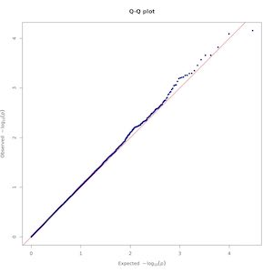
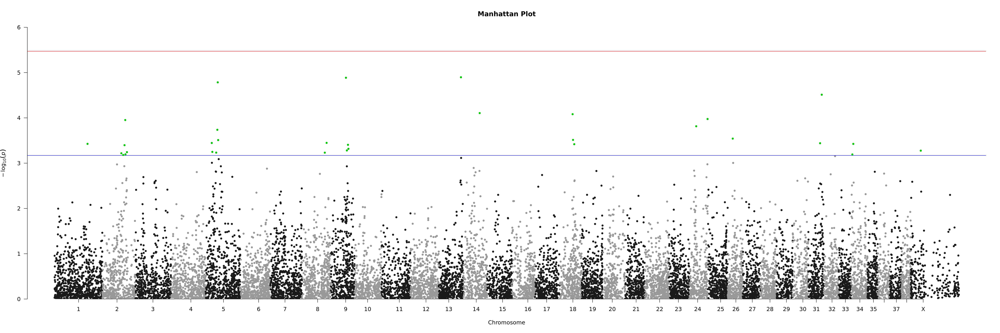
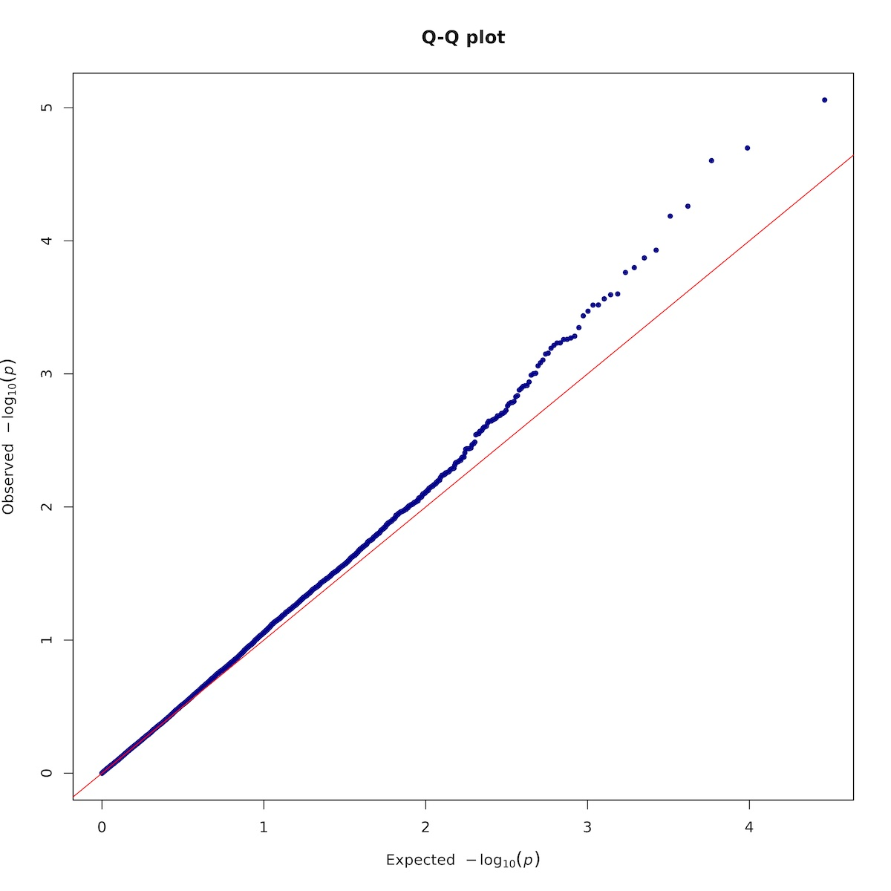

We will use 2 different software packages to perform the GWAS analysis. Each one use a different stastical approach to adjust for population stratification. We will use the genomic control λ to assess the efficiency of each. 

## 7.1.  GWAS by Plink

## 7.1.1.  linear model


PLINK 2.0 has the new `--glm` command for association analysis (instead of  `--linear` and `--logistic` in Plink 1.9). For quantitative phenotypes, `--glm` fits a linear model while for binary phenotypes, it fits a logistic or Firth regression model instead.

*  The model has a fixed-covariate matrix to include covariates loaded by `--covar`.
    *  It is now standard practice to include top principal components (usually computed by `--pca`) as covariates in any association analysis, to correct for population stratification 
    *  You can add the 'sex' modifier to include .fam/.psam sex as a covariate 
*  Dataset precautions:
    *  This method does not properly adjust for small-scale family structure. As a consequence, it is usually necessary to prune close relations
    *  It is advised to exlcude variants with very small minor allele count ("--mac 20" is a reasonable filter to apply). <br>
    Our filtered dataset already fullfill these precautions
*  The model uses the minor allele dosages by default. To make it always contain ALT allele dosages instead (the A1 column of the main report), we need to add the 'omit-ref' modifier. 


Here, we will adjust for sex and 3 PCs 

```
plink2 --bfile $gwas/AxiomGT1v2.noRelatives.filtered.LD_prune.${target} --chr-set 38 no-xy --allow-extra-chr \
       --pheno $gwas/${target}.pheno \
       --chr 1-38, X \
       --glm sex 'hide-covar' --ci 0.95 \
       --covar $gwas/AxiomGT1v2.noRelatives.filtered.LD_prune.${target}.pca.eigenvec --covar-name PC1,PC2,PC3 \
       --output-chr 26 --out $gwas/AxiomGT1v2.noRelatives.filtered.LD_prune.${target}.glm
```

Here is the output

```
PLINK v2.00a2.3LM 64-bit Intel (24 Jan 2020)   www.cog-genomics.org/plink/2.0/
(C) 2005-2020 Shaun Purcell, Christopher Chang   GNU General Public License v3
Logging to gwas_output/AxiomGT1v2.noRelatives.filtered.LD_prune.atopy.glm.log.
Options in effect:
  --allow-extra-chr
  --bfile gwas_output/AxiomGT1v2.noRelatives.filtered.LD_prune.atopy
  --chr 1-38, X
  --chr-set 38 no-xy
  --ci 0.95
  --covar gwas_output/AxiomGT1v2.noRelatives.filtered.LD_prune.atopy.pca.eigenvec
  --covar-name PC1,PC2,PC3
  --glm sex hide-covar
  --out gwas_output/AxiomGT1v2.noRelatives.filtered.LD_prune.atopy.glm
  --output-chr 26
  --pheno gwas_output/atopy.pheno

Start time: Mon Aug 28 12:02:53 2023
64289 MiB RAM detected; reserving 32144 MiB for main workspace.
Using up to 32 threads (change this with --threads).
2093 samples (1038 females, 1055 males; 2093 founders) loaded from
gwas_output/AxiomGT1v2.noRelatives.filtered.LD_prune.atopy.fam.
14825 out of 14885 variants loaded from
gwas_output/AxiomGT1v2.noRelatives.filtered.LD_prune.atopy.bim.
1 binary phenotype loaded (326 cases, 1767 controls).
3 covariates loaded from gwas_output/AxiomGT1v2.noRelatives.filtered.LD_prune.atopy.pca.eigenvec.
Calculating allele frequencies... done.
--glm logistic regression on phenotype 'PHENO1': done.
Results written to gwas_output/AxiomGT1v2.noRelatives.filtered.LD_prune.atopy.glm.PHENO1.glm.logistic .
```

## 7.1.2. genomic control

The genomic control λ value (often referred to as the "genomic inflation factor") is used to measure and correct for population stratification. A λ value close to 1 suggests that the results are not inflated due to population stratification, while values greater than 1 suggest potential inflation. [However, values up to 1.10 are generally considered acceptable for a GWAS](https://jbiomedsci.biomedcentral.com/articles/10.1186/s12929-021-00733-7#:~:text=The%20genomic%20inflation%20factor%20%CE%BB,considered%20acceptable%20for%20a%20GWAS.) <br>
We can use the results of our regression analysis to calculate the genomic control λ value:

```
## λ = observed median chi-square statistic / 0.456
## Chi-square statistic = Z_stat<sup>2</sup>

tail -n+2 $gwas/AxiomGT1v2.noRelatives.filtered.LD_prune.${target}.glm.PHENO1.glm.logistic | awk '{print $13*$13}' | sort | awk '{count[NR] = $1;}\
END{
if(NR % 2){gif = count[(NR + 1) / 2];} else {gif = (count[(NR / 2)] + count[(NR / 2) + 1]) / 2.0;}
print "Genomic inflation factor = " gif/0.456;}'
```

Genomic inflation factor = 1.13221 


## 7.1.3. Plotting


```
input_asc="$gwas/AxiomGT1v2.noRelatives.filtered.LD_prune.${target}.glm.PHENO1.glm.logistic"
output_prefix="$gwas/${target}.glm.logistic"

Rscript -e 'args=(commandArgs(TRUE));require(qqman);'\
'asc <- read.table(args[1],head=TRUE,comment.char="");'\
'asc <- na.omit(asc);'\
'tiff(paste(args[2],".qqplot.tif",sep=""),units="in", width=10, height=10, res=300);'\
'qq(asc$P, main = "Q-Q plot", col = "blue4");'\
'dev.off();'\
'noOfTests <- dim(asc)[1];bonf <- 0.05/as.numeric(noOfTests);bonfBy200 <- 10/as.numeric(noOfTests);'\
'sigSNPs <- asc$ID[which(asc$P<=bonfBy200)];'\
'tiff(paste(args[2],".manh.tif",sep=""),units="in", width=30, height=10, res=300);'\
'manhattan(asc, main = "Manhattan Plot", chr = "X.CHROM", bp = "POS", p = "P", snp = "ID", ylim = c(0, 6), chrlabs = c(1:38, "X"),suggestiveline =  -log10(bonfBy200), genomewideline =  -log10(bonf), highlight = sigSNPs);'\
'dev.off();'  "$input_asc" "$output_prefix"
```

Here is the Q-Q plot

<!-- -->


And the Manhaten plot

<!-- -->


## 7.2.  GWAS by GCTA

## 7.2.1.  Mixed linear model


Mixed model association software such as SAIGE, BOLT-LMM, GCTA, or FaST-LMM instead; or regenie's whole genome regression can better handel genetic relatedness. In this tutroial, we will use `--mlma-loco` for mixed linear model based association analysis. 

```
y = a + bx + g + e
```

where: 
*  y is the phenotype
*  a is the mean term (i.e. intercept)
*  b is the additive effect (fixed effect) of the candidate SNP to be tested for association
*  x is the SNP genotype indicator variable coded as 0, 1 or 2
*  g is the polygenic effect (random effect) i.e. the accumulated effect of all SNPs (as captured by the GRM calculated using all SNPs)  
*  e is the residual. 

The MLM leaving-one-chromosome-out (LOCO) analysis implements the model with the chromosome, on which the candidate SNP is located, excluded from calculating the GRM. This means that g is the accumulated effect of all SNPs except those on the chromosome where the candidate SNP is located. The var(g) will be re-estimated each time when a chromosome is excluded from calculating the GRM. The MLM-LOCO analysis is computationally less efficient but more powerful as compared with the classical MLM analysis.

>  *Note1:* The mixed linear model incorporates the genetic relationship matrix (GRM) to capture the accumulated effect of all SNPs which accounts for population stratification to a large extent. Therefore, there is no need to adjust for top PCs.

>  *Note2:* By default, the model include covariates (if provided) as fixed effects and the phenotype will be adjusted by the mean (i.e. intercept) and covariates before testing for SNP association. However, if SNPs are correlated with the covariates, pre-adjusting the phenotype by the covariates will probably cause loss of power. If the `--mlma-no-preadj-covar` option is specified, the covariates will be fitted together with the SNP for association test. However, this will significantly reduce computational efficiency.

```
gcta64 --mlma-loco --bfile gcta/AxiomGT1v2.noRelatives.filtered.LD_prune.gcta --autosome-num 38 --autosome \
       --grm gcta/AxiomGT1v2.noRelatives.filtered.LD_prune.gcta_grm \
       --pheno $gwas/${target}.pheno \
       --covar gender.txt --mlma-no-preadj-covar \
       --out $gwas/${target}_asc --thread-num 10

```

## 7.2.2. genomic control:


The output of the MLM-LOCO analysis does not have chi-square statistic, however the p-values can be converted to chi-squared statistics for 1 degree of freedom by using the inverse of the cumulative distribution function (CDF) of the chi-squared distribution. This can be easily done using python

```
## Let us prepaper our conda environmnet to run Python
mamba install -c conda-forge python=3.11.4 pandas=2.0.3 scipy=1.11.2
```

Now, we can open python in interactive mode by using the command `python`. Once we are dome, we can exit the interactive mode by using the `exit()` function

```python

import pandas as pd
import scipy.stats as stats

# Load the GCTA-LOCO results
gwas_results = pd.read_table("gwas_output/atopy_asc.loco.mlma", delim_whitespace=True)

# Convert p-values to chi-squared statistics
gwas_results['CHISQ'] = stats.chi2.ppf(1 - gwas_results['p'], df=1)

# Calculate lambda
lambda_value = gwas_results["CHISQ"].median() / 0.456

print("Genomic control λ:", lambda_value)
```

Genomic control λ: 1.0218973008189114 which is GREAT!


## 7.2.3.  Plotting


```
input_asc="$gwas/atopy_asc.loco.mlma"
output_prefix="$gwas/${target}.loco.mlma"

Rscript -e 'args=(commandArgs(TRUE));require(qqman);'\
'asc <- read.table(args[1],head=TRUE,comment.char="");'\
'asc <- na.omit(asc);'\
'tiff(paste(args[2],".qqplot.tif",sep=""),units="in", width=10, height=10, res=300);'\
'qq(asc$p, main = "Q-Q plot", col = "blue4");'\
'dev.off();'\
'noOfTests <- dim(asc)[1];bonf <- 0.05/as.numeric(noOfTests);bonfBy200 <- 10/as.numeric(noOfTests);'\
'sigSNPs <- asc$SNP[which(asc$p<=bonfBy200)];'\
'tiff(paste(args[2],".manh.tif",sep=""),units="in", width=30, height=10, res=300);'\
'manhattan(asc, main = "Manhattan Plot", chr = "Chr", bp = "bp", p = "p", snp = "SNP", ylim = c(0, 6),suggestiveline =  -log10(bonfBy200), genomewideline =  -log10(bonf), highlight = sigSNPs);'\
'dev.off();'  "$input_asc" "$output_prefix"
```

Here is the Q-Q plot

<!-- -->


And the Manhaten plot

<!-- -->

